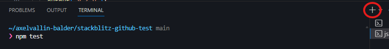

# balderjs-template

## Run
`npm install`  
`npx balderjs`

## Att tänka på
  
<details>
<summary>Vanliga fel vid if-satser</summary>

**Använda = istället för ==**
```
if (x = 1) // Fel
    write("Ett")
```                    
Gör en tilldelning. Variabeln x blir 1. Hela uttrycket blir 1, vilket sedan tolkas som sant.

```
if (x == 1) // Rätt
    write("Ett")
```        
**Använda =< istället för <=**
```
if (x =< 0) // Fel
    write("Mindre än eller lika med noll")
```                    
Skriv tecknen i den ordning man säger dem; "mindre än" eller "lika med".

```
if (x <= 0) // Rätt
    write("Mindre än eller lika med noll")
```                    
**Inte använda else-if om flera alternativ**
```
if (x == 0)
    write("Noll")
if (x == 1) // Fel 
    write("Ett")
else
    write("Annat")
```                    
Om x har värdet 0 så kommer både "Noll" och "Annat" att skrivas ut!

```
if (x == 0)
    write("Noll")
else if (x == 1) // Rätt
    write("Ett")
else
    write("Annat")
```                
**Använda &&, eller ||, utan två villkor**
```
if (x == 0 || 1) // Fel
    write("Noll eller ett")
```                    
På båda sidor om || så måste det finnas ett villkor.

```
if (x == 0 || x == 1) // Rätt
    write("Noll eller ett")
```                    
Samma sak gäller för &&.

**Testa intervall utan &&**
```
if (0 <= x <= 10) // Fel
    write("I intervallet [0, 10]")
```                    
De två villkoren måste sättas ihop med &&.

```
if (0 <= x && x <= 10) // Rätt
    write("I intervallet [0, 10]")
```                 
**Använda indentering istället för satsblock**
```
if (x < 0)
    write("Negativt. Byt tecken")
    x = -x; // Fel
```
                    
Den sista satsen kommer alltid att utföras, även då x är positivt. Fixa till det genom att skapa ett satsblock.

```
if (x < 0) { // Rätt
    text("Negativt. Byt tecken");
    x = -x
}
```                 
**Fel ordning vid flera olikhetstester**
```
if (n < 1000)
    write("n mindre än 1000") // Fel
else if (n < 100)
    write("n mindre än 100")
else if (n < 10)
    write("n mindre än 10")
```                 
Den första satsen blir sann för alla värden mindre än tusen, de övriga testas aldrig. Ett n-värde på 42 skulle producera utskriften "n mindre än 1000" och inte, som avsett, "n mindre än 100".

```
if (n < 10)
    write("n mindre än 10") // Rätt
else if (n < 100)
    write("n mindre än 100")
else if (n < 1000)
    write("n mindre än 1000")
```
</details>

## Uppgifter
I app.ts finns ett antal funktioner som motsvarar varje uppgift nedan.
Det enda du behöver förstå är att koden till uppgift 1 skrivs på mellan { och } efter den funktion som heter uppgift1.

Om du vill köra koden för uppgift 1 så skriver du ```uppgift1()``` på valfri rad som **inte** ligger i en funktion, t.ex. högst upp i app.ts. Du kan köra flera funktioner efter varandra.

För att bekräfta att din kod är korrekt så öppnar du en ny terminal och skriver ```npm test```

Du behöver **inte** inkludera funktionsanrop (```uppgift1()```) i din kod för att funktionen ska testas. Det är egentligen bättre om du inte gör det.

Testet kör alla funktioner och visar vad som fungerar och vad som inte gör det. Uppgifter som inte gjorts markeras som ```todo```.

### Uppgift 1
Gör ett program som frågar efter din ålder och skriver ut om du är myndig (minst 18 år) eller inte.

```
Ålder: 17
Omyndig
```

### Uppgift 2
Gör ett program som frågar hur lång du är. Om svaret är under 200 ska programmet säga "Hej du korte!" annars "Hej du långe!".

```
Hur lång är du (i cm)? 202
Hej du långe!
```

### Uppgift 3
Gör ett program som läser in ett tal och presenterar en av utskrifterna "Talet är negativt.", "Talet är positivt." eller "Talet är noll.".

```
Ett tal: -32
Talet är negativt.
```

### Uppgift 4
In med värden till variablerna x och y. Ut med något av meddelandena "x = y", "x < y" eller "x > y".

```
x = 5
y = 7
x < y
```

### Uppgift 5
Gör ett litet beräkningsprogram enligt nedan.

```
Tal 1: 34
Tal 2: 75
Operator (+, -, *, /): +
Summa: 109
```

### Uppgift 6
Skriv ett program som givet ett spelkorts valör (1-13) kan skriva vad spelkortet är. Låt 1 motsvara ess, 11 knekt, 12 dam och 13 kung.

```
Valör (1-13): 7
En 7:a
```

### Uppgift 7
Läs in ett månadsnummer (1-12) och skriv ut namnet på månaden.

```
Månadsnummer: 10
Oktober
```

### Uppgift 8
Läs in ett månadsnummer och skriv ut vilken årstid det motsvarar. Låt månad 12, 1, 2 motsvara vinter, 3-5 vår, 6-8 sommar och 9-11 höst.

```
Månadsnummer: 10
Höst
```

### Uppgift 9
Skriv ett program där du skriver in två heltal och sedan försöker beräkna deras produkt. Programmet rättar dig om räknat fel.

```
Tal 1: 11
Tal 2: 12
Produkt: 130
Fel. Rätt svar: 132
```

### Uppgift 10
In med två heltal och ut med lite info om talen på följande sätt:

```
Tal 1: 4
Tal 2: 7
Summa: 11
Medel: 5.5
Minsta: 4
Största: 7
```

### Uppgift 11
Gör föregående uppgift med tre tal istället.

### Uppgift 12
Detta program ska kunna avgöra om ett inmatat tecken är en liten bokstav, stor bokstav eller annat tecken. Det räcker om det fungerar för tecken i det engelska alfabetet (A-Z).

```
Tecken: B
Stor bokstav
```

### Uppgift 13
Detta program ska kunna avgöra om ett inmatat tecken är en liten bokstav, stor bokstav eller annat tecken. Det räcker om det fungerar för tecken i det engelska alfabetet (A-Z).

```
Mata in ett tal mellan -999 och 999: 32
Två siffror
Positivt
```

### Uppgift 14
Om tre tal ska kunna vara sidor i en triangel så måste samtliga tal vara större än noll och inget tal större än de andra två tillsammans. Skriv ett program som frågar efter längden på tre sidor och som kollar om en triangel kan bildas med de angivna värdena.

```
Sida 1: 5
Sida 2: 10
Sida 3: 4
Triangel? Nej!
```